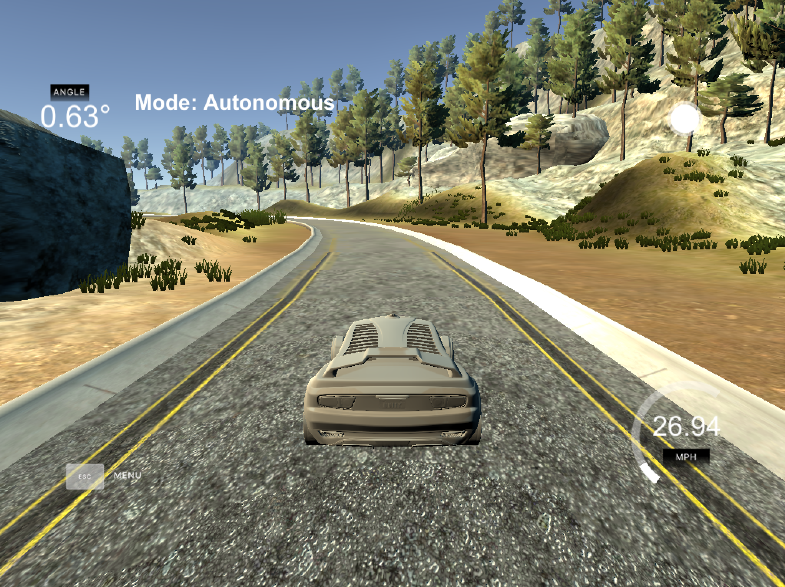

# PID-Control-Project



## Reflection

### Hyperparameter selection

Initially I manually experimented with the values for the P, I and D components, but then decided to use the twiddle algorithm to fine-tune parameters. For this purpose I re-wrote the algorithm to match up with the continuous "while-loop" of the WebSockets-API in the C++ code. Hence, I let the simulator run for 10000 time-steps, evaluate the outcome, and then restart with modified parameter settings.

Afterwards, I chose these initial values for training, which already gave me a good baseline before and are based on the values in the classroom:

```
Initial values for training
p: 0.3, 0.0009, 6.0
dp: 0.1, 0.00001, 1.0
```

The values I ended up after running the simulator for around 12 hours are the following:

```
p: 0.374251, 0.000887792, 6.0
dp: 0.00100432, 8.2172e-08, 0.00273893

```

It's interesting to see that the I- and -D values remained almost the same, whereas 0.3 was increased by a magnited of nearly 0.08.

### Effects of the P,I,D components

#### P-Component

The P-Component, i.e. the `Proportional` component of the controller, weighs the error at a given step with a fixed constant (here: `0.374251`). Basically, this leads to an oscillating behaviour because only the current error is taken into account and a counter-action of a fixed magnitude is conducted. The higher the weight, the stronger the counter-action.

#### I-Component

The I-Component, i.e. the `Integral` component of the controller, weighs the error of all previous time-steps (here: `0.000887792`). It takes into account the history of errors, not only the current time-step. In general, this component is used to compensate for systematic biases, e.g. constant side-winds experienced on a high-way that hinder a car in moving lanes. By summing errors, the I-Component will be able to add-in these systemic biases and allow for a correction of the trajectory.

In this project I didn't observe any particular biases, however, I noticed that a small I-term helped smoothing the trajectory, especially in the curvy parts of the track. I suppose that's because in addition to the D-component, a part of the cumulated error is taken into account at each time step, i.e. beginning a steering action "just a little earlier" and leading to less stronger oscillation. 

Please note: If the parameter value is chosen too large or too small it will add in "more" or "less" of the cumulated error over all time steps, leading to a more unpredictable oscillation behaviour when the other parameters don't adapt to compensate for it.

#### D-Component

The D-Component, i.e. the `Derivative` component of the controller, weighs the error of the difference between the current and the previous time-step (here: `6.0`). The D-Component is the strongest influencer to smoothen out the trajectory by taken into account the direction of change in the error. Hence, in addition to the P-Component, the D-Component will add on an extra error when the error difference is large, e.g. in curvy road parts, leading to the car steering stronger when loosing trajectory. When the error difference decreases, the add-on will also be lower, smoothing out the trajectory.


### General remarks

I observed a strong dependency between the three parameters, i.e. one (or more) components compensate for the behaviour of the others. This leads me to the conclusion that the optimal parameter values I found might only be local optima given the search strategy I employed and the initial values I chose.

